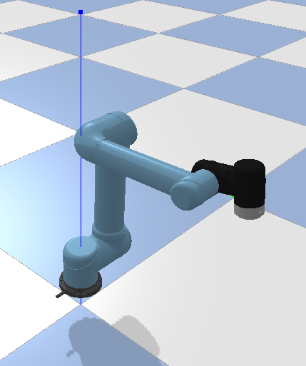

# UR5 Robot Dynamics and Kinematics

<div style="display: flex; align-items: center; gap: 20px;">
  <div style="flex: 1;">
    <p>A complete implementation of analytical kinematic and dynamic models for the UR5 robot from Universal Robots, with physics-based simulation and 3D visualization.</p>
  </div>
  <div>
    
  </div>
</div>


## 🚀 Quick Start

```bash
# 1. Install dependencies
pip install mujoco numpy sympy matplotlib

# 2. Compute dynamics (symbolic)
python UR5.py

# 3. Run visualization
python ur5_animation.py
```

## 📋 What's Included

### Core Files
- **UR5.m** - Original MATLAB implementation with DH parameters
- **UR5.py** - Python port with symbolic dynamics computation
- **ur5_model.xml** - MuJoCo physics model
- **ur5_robot.urdf** - Gazebo/ROS robot description
- **ur5_animation.py** - 3D visualization with matplotlib ⭐ **EASIEST**
- **ur5_simulation.py** - MuJoCo simulation (headless mode)
- **ur5_gazebo_simulation.py** - Gazebo simulation (realistic graphics) 🎨 **BEAUTIFUL**
- **run_simulation.py** - Interactive launcher

### Documentation
- **QUICKSTART.md** - Get running in 2 minutes
- **DOCKER_QUICKSTART.md** - Gazebo in Docker (3 easy steps) 🐳
- **SIMULATION_README.md** - Detailed simulation guide
- **GAZEBO_SETUP.md** - Gazebo Classic 11 (Linux only, ROS-free)
- **GAZEBO_JETTY_MACOS.md** - New Gazebo on macOS from source (advanced)
- **DOCKER_GAZEBO.md** - Complete Docker guide with ROS2

## 🎯 Features

✅ **Analytical Dynamics** - Symbolic computation of M, C, G matrices  
✅ **Forward Kinematics** - DH parameter-based transformation matrices  
✅ **Jacobian Computation** - 6×6 end-effector Jacobian  
✅ **Physics Simulation** - MuJoCo-based dynamics  
✅ **3D Visualization** - Animated robot motion with matplotlib  
✅ **PD Control** - Position control with trajectory following  

## 📦 Installation

```bash
# Minimum requirements
pip install numpy sympy

# For simulation
pip install mujoco

# For visualization
pip install matplotlib pillow

# For Gazebo (realistic graphics) - Linux only
# Ubuntu/Debian:
sudo apt install gazebo11 libgazebo11-dev
pip install pygazebo protobuf
# macOS: Gazebo 11 deprecated, use MuJoCo/Matplotlib instead
```

## 🎮 Usage Examples

### Compute Robot Dynamics
```bash
python UR5.py
```
**Output:** `UR5.pkl`, `UR5T.txt`, `UR5M.txt`, `UR5C.txt`, `UR5G.txt`, `UR5J.txt`

### Create Animation (Works on All Platforms) ⭐
```bash
python ur5_animation.py
```
**Output:** `ur5_animation.gif`, `ur5_configurations.png`  
**Best for:** Quick visualization, presentations, no setup required

### Platform-Specific Simulations

#### 🐧 Linux: Gazebo (Industry Standard) 🎨
```bash
python ur5_gazebo_simulation.py
```
**Features:**
- Professional-quality 3D graphics
- Realistic lighting and shadows
- Industry-standard simulation
- ROS-compatible (optional)

**Installation:** See [GAZEBO_SETUP.md](GAZEBO_SETUP.md)

#### 🍎 macOS: Multiple Options

**Option 1: MuJoCo (Easiest, 5 min setup) ⭐**
```bash
mjpython ur5_simulation.py
```
- Fast, interactive 3D visualization
- Real-time physics
- Click-and-drag camera control

**Option 2: Docker + Gazebo (Best graphics, ROS2 support) 🐳**
```bash
# See DOCKER_QUICKSTART.md for 3-step setup
./run_gazebo_docker.sh
```
- Professional rendering with ROS2
- Industry-standard simulation
- Full Gazebo + ROS2 environment

**Option 3: Gazebo Jetty from Source (Advanced, 1-2 hr)**
```bash
# See GAZEBO_JETTY_MACOS.md
source ~/workspace/install/setup.zsh
gz sim ur5_robot.sdf
```
- Latest Gazebo features
- Compile from source required

#### 🪟 Windows: Multiple Options
```bash
# Option 1: Matplotlib (easiest)
python ur5_animation.py

# Option 2: MuJoCo headless
python ur5_simulation.py no-viewer

# Option 3: WSL2 + Gazebo (advanced)
# Use Linux instructions in WSL
```

### Headless Simulation (All Platforms)
```bash
python ur5_simulation.py no-viewer
```
**Output:** Terminal output with mass matrix, Jacobian, dynamics

### Interactive Launcher
```bash
python run_simulation.py
```

## 📊 Using the Dynamics Data

```python
import pickle
import numpy as np

# Load computed dynamics
with open('UR5.pkl', 'rb') as f:
    data = pickle.load(f)

T = data['T']        # Forward kinematics (4×4)
M = data['M']        # Mass matrix (6×6)
C = data['C']        # Coriolis matrix (6×6)
G = data['G']        # Gravity vector (6×1)
J = data['Jacobi']   # Jacobian (6×6)

# Substitute joint values
q_vals = {q_1: 0, q_2: -np.pi/4, q_3: np.pi/2, ...}
M_numeric = M.subs(q_vals)
```

## 🤖 Robot Specifications

**UR5 Universal Robot**
- 6 DOF articulated arm
- Joint ranges: ±360° (most joints)
- Link lengths: 425mm (shoulder-elbow), 392mm (elbow-wrist)
- Total mass: ~18.4 kg
- Payload capacity: 5 kg

## 📝 Notes

- **MuJoCo viewer** may not work on all systems (SSH, headless servers)
- Use `ur5_animation.py` for reliable visualization
- PyBullet is **not supported** due to compilation issues on modern macOS
- The analytical model matches the original MATLAB implementation

## 📚 References

- [Universal Robots UR5 technical specifications](chrome-extension://efaidnbmnnnibpcajpcglclefindmkaj/https://www.universal-robots.com/media/50588/ur5_en.pdf)
- Denavit-Hartenberg parameters convention
- MuJoCo physics engine documentation

## 🎯 Which Simulator Should I Use?

| Feature | Gazebo (Linux) | MuJoCo (macOS) | Matplotlib (All) |
|---------|----------------|----------------|------------------|
| **Platforms** | Linux only | macOS, Linux | All platforms |
| **Graphics Quality** | ⭐⭐⭐⭐⭐ | ⭐⭐⭐⭐ | ⭐⭐⭐ |
| **Setup Difficulty** | Hard | Easy | Easiest |
| **Real-time Control** | ✅ Yes | ✅ Yes | ❌ No |
| **Lighting/Shadows** | ✅ Professional | ⚠️ Basic | ❌ No |
| **Export GIF/Video** | ⚠️ Manual | ⚠️ Manual | ✅ Automatic |
| **Community Size** | ⭐⭐⭐⭐⭐ | ⭐⭐⭐⭐ | ⭐⭐⭐ |
| **Best For** | Research, ROS projects | macOS users, ML | Quick viz, papers |

**Quick Recommendations:**
- **Linux users**: Use Gazebo for best graphics and ROS compatibility
- **macOS users**: Use MuJoCo interactive viewer (mjpython)
- **Everyone**: Use Matplotlib for quick, reliable visualization
- **Paper/presentation**: Matplotlib creates publication-ready figures

## 🔧 Troubleshooting

**"No display found"**  
→ Use `python ur5_animation.py` or `python ur5_simulation.py no-viewer`

**"Module not found"**  
→ Install missing packages: `pip install mujoco numpy sympy matplotlib`

**Computation takes long time**  
→ Normal for symbolic computation (~30 seconds to 2 minutes)

**🍎 MuJoCo GUI on macOS: "requires mjpython"**  
→ On macOS, MuJoCo viewer requires `mjpython` instead of `python`:
```bash
mjpython ur5_simulation.py
```
If `mjpython` is not available, install it with MuJoCo or use the matplotlib alternative:
```bash
python ur5_animation.py  # Works with regular python
```

## � Citation

If you use this work in your research, please cite:

```bibtex
@inproceedings{kebria2016kinematic,
  title={Kinematic and dynamic modelling of UR5 manipulator},
  author={Kebria, Parham M and Al-Wais, Saba and Abdi, Hamid and Nahavandi, Saeid},
  booktitle={2016 IEEE international conference on systems, man, and cybernetics (SMC)},
  pages={004229--004234},
  year={2016},
  organization={IEEE},
  doi={10.1109/SMC.2016.7844896}
}
```

**Paper:** [IEEE Xplore](https://doi.org/10.1109/SMC.2016.7844896)

## 📄 License

See [LICENSE](https://github.com/parhamkebria/UR5/blob/main/LICENSE) for details.
